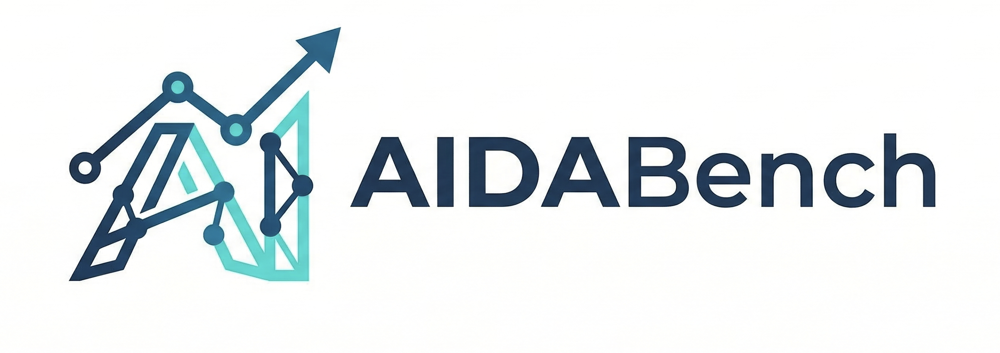
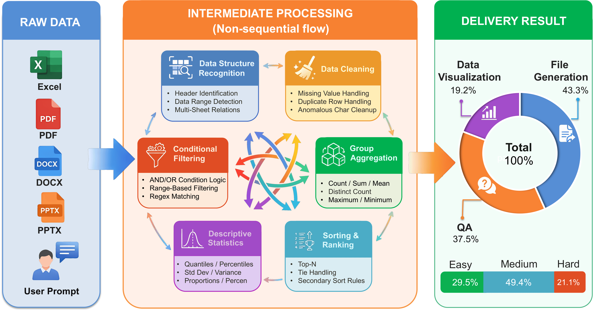
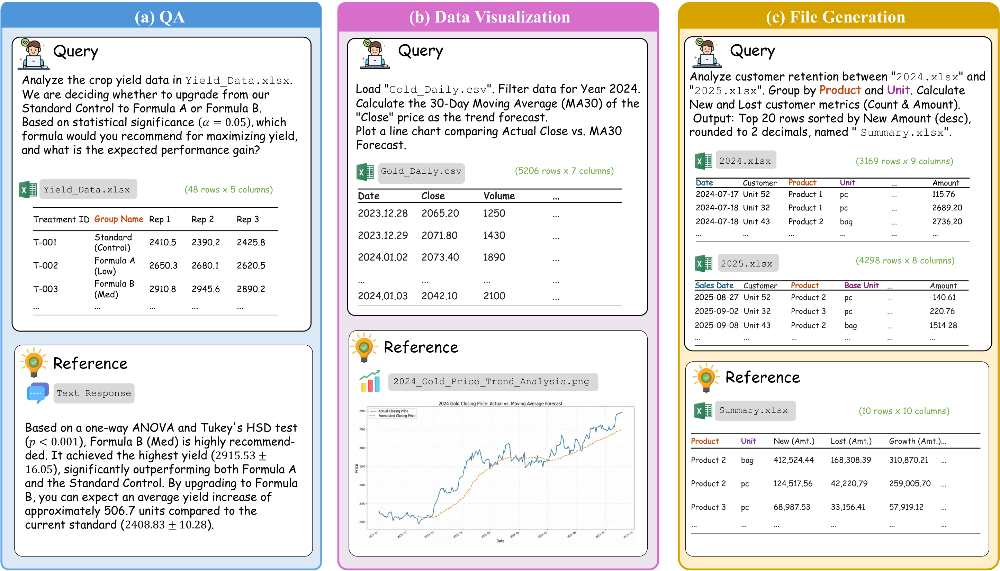
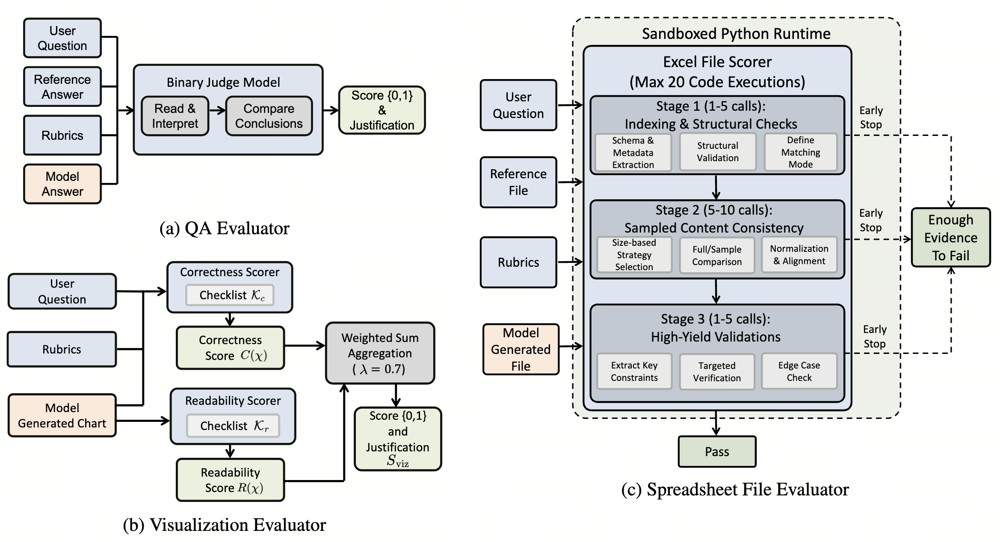

<div align="center">



# AIDABench: AI 数据分析基准

[](https://arxiv.org/abs/2603.15636)
[](https://huggingface.co/datasets/MichaelYang-lyx/AIDA)
[](https://github.com/MichaelYang-lyx/AIDABench)
[](LICENSE)
[](https://www.python.org/)

**面向真实文档的端到端 AI 数据分析能力综合评测基准**

[**论文**](https://arxiv.org/abs/2603.15636) | [**数据集**](https://huggingface.co/datasets/MichaelYang-lyx/AIDA) | [**代码**](https://github.com/MichaelYang-lyx/AIDABench) | [**English**](README.md)

---

</div>

## 快速开始

### 1. 环境配置

```bash
# 安装 uv
curl -LsSf https://astral.sh/uv/install.sh | sh

# 创建并激活环境
uv venv
source .venv/bin/activate

# 安装所有依赖
uv sync --all-extras
```

<details>
<summary><b>可用功能组说明</b></summary>

| 功能组         | 描述                                |
| :------------- | :---------------------------------- |
| `analysis`     | numpy、pandas、matplotlib、scipy 等 |
| `excel`        | xlsxwriter、pyxlsb、calamine        |
| `docx`         | python-docx、docxtpl 等             |
| `pptx`         | python-pptx、pptxtopdf 等           |
| `pdf`          | pypdf、pdfminer、camelot 等         |
| `image`        | pillow、opencv、heif/avif 支持      |
| `ocr`          | tesseract、easyocr                  |
| `convert`      | 文档格式转换（LibreOffice）         |
| `aspose_cloud` | Aspose Cloud SDK                    |
| `all`          | 以上全部                            |

</details>

### 2. 下载数据集

```bash
uv run python download_data.py
```

### 3. 配置环境变量

```bash
cp .env.example .env
```

编辑 `.env` 并填写以下变量：

```env
# 图表评测（Gemini）
CHART_EVAL_API_URL=
CHART_EVAL_API_KEY=
CHART_EVAL_MODEL_NAME=gemini-3-pro-preview

# 数值评测（QwQ）
NUMERICAL_EVAL_API_URL=
NUMERICAL_EVAL_API_KEY=
NUMERICAL_EVAL_MODEL_NAME=QwQ-32B

# 文件生成评测（Claude）
FILE_GENERATION_EVAL_API_URL=
FILE_GENERATION_EVAL_API_KEY=
FILE_GENERATION_EVAL_MODEL_NAME=claude-sonnet-4-5-20250929
```

### 4. 运行推理与评估

```bash
# ====== 配置 ======
MODEL_NAME="YOUR_MODEL_NAME"
SAVE_NAME="YOUR_SAVE_NAME"
BASE_URL="http://YOUR_API_BASE_URL/v1"
API_KEY="YOUR_API_KEY"
# ====================

# 运行推理（dataset=all 同时运行 QA、data_visualization、file_generation）
uv run infer/run.py \
  --dataset all \
  --base_url "${BASE_URL}" \
  --api_key "${API_KEY}" \
  --model_name "${MODEL_NAME}" \
  --save_name "${SAVE_NAME}" \
  --num_workers 10 \
  --prompt_file openai_tool_general_20round.txt \
  --agent_type "openai_subprocess_agent" \
  --max_rounds 20

# 运行评估
uv run python evaluation/run.py --dataset file_generation --model_name "${SAVE_NAME}" --max_workers 10
uv run python evaluation/run.py --dataset QA --model_name "${SAVE_NAME}" --max_workers 5
uv run python evaluation/run.py --dataset data_visualization --model_name "${SAVE_NAME}" --max_workers 5
```

## 概览

现有基准往往聚焦于单一能力或简化场景。**AIDABench** 填补了这一空白，提供覆盖异构数据源的端到端数据分析任务——包括电子表格、数据库、财务报告和运营记录等。

<div align="center">

<br/>
<em>图 1：AIDABench 评测框架概览</em>
</div>

## 任务类别

AIDABench 围绕三大核心能力维度组织：

| 类别           | 占比  | 描述                                           |
| :------------- | :---: | :--------------------------------------------- |
| **文件生成**   | 43.3% | 数据整理——筛选、规范化、去重、连接、跨表关联   |
| **问答 (QA)**  | 37.5% | 分析查询——聚合、排序、比较、趋势分析           |
| **数据可视化** | 19.2% | 图表创建——柱状图/折线图/饼图，含样式需求和约束 |

### 任务难度

| 级别 | 占比  | 推理步数 |
| :--- | :---: | :------- |
| 简单 | 29.5% | ≤ 6 步   |
| 中等 | 49.4% | 7–12 步  |
| 困难 | 21.1% | ≥ 13 步  |

> **27.4%** 的任务需要跨文件推理，涉及多达 14 个输入文件。

<div align="center">

<br/>
<em>图 2：QA、数据可视化和文件生成的评测场景示例</em>
</div>

## 评测框架

所有模型在统一的**工具增强协议**下进行评测：模型接收任务指令和关联文件，在**沙箱环境**中执行**任意 Python 代码**以完成任务。

采用三个专用的 **LLM 评测器**：

| 评测器           | 评测目标   | 方法                   |
| :--------------- | :--------- | :--------------------- |
| **QA 评测器**    | 文本回答   | 二元判断答案正确性     |
| **可视化评测器** | 图表与图片 | 评分正确性 + 可读性    |
| **文件评测器**   | 电子表格   | 粗到细的结构与内容验证 |

<div align="center">

<br/>
<em>图 3：AIDABench 三类评测器的设计</em>
</div>

## 引用

如果 AIDABench 对您的研究有帮助，请引用我们的论文：

```bibtex
@article{yang2026aidabench,
  title={AIDABench: AI Data Analytics Benchmark},
  author={Yang, Yibo and Lei, Fei and Sun, Yixuan and Zeng, Yantao and Lv, Chengguang and Hong, Jiancao and Tian, Jiaojiao and Qiu, Tianyu and Wang, Xin and Chen, Yanbing and Li, Yanjie and Pan, Zheng and Zhou, Xiaochen and Chen, Guanzhou and Lv, Haoran and Xu, Yuning and Ou, Yue and Liu, Haodong and He, Shiqi and Jia, Anya and Xin, Yulei and Wu, Huan and Liu, Liang and Ge, Jiaye and Dong, Jianxin and Lin, Dahua and Sun, Wenxiu},
  journal={arXiv preprint arXiv:2603.15636},
  year={2026}
}
```

<div align="center">

---

AIDABench 团队倾力打造

</div>
